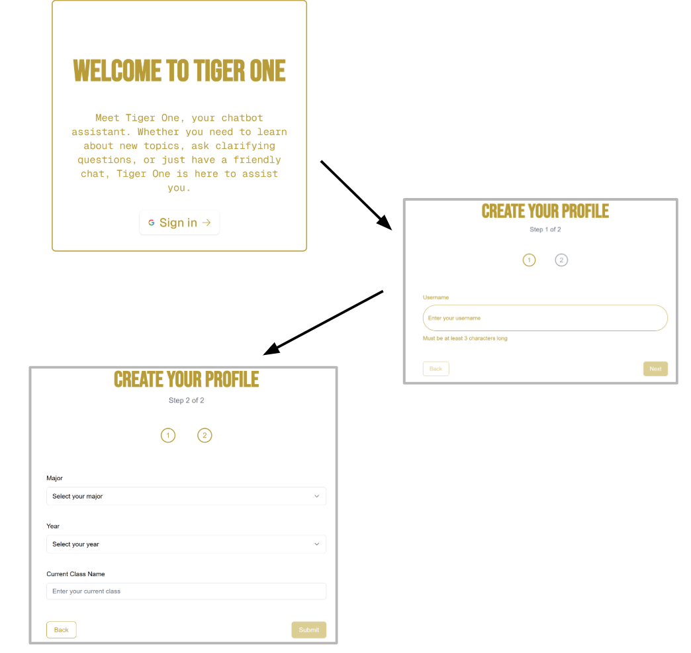
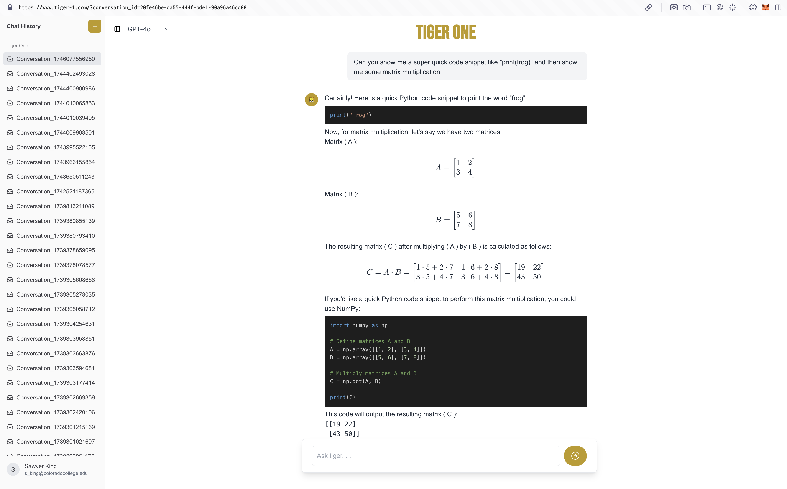
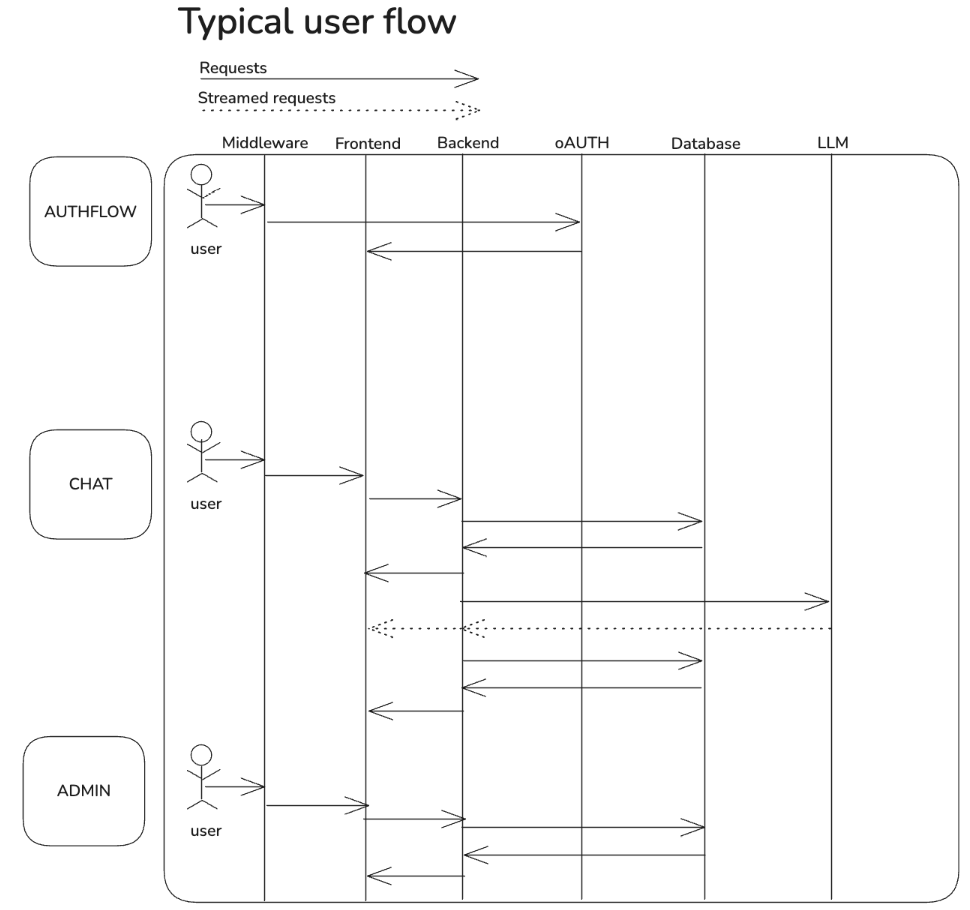

# TIGERONE

<div align="center">
  <h3>Your AI-powered academic assistant at Colorado College</h3>
</div>

## 📝 Overview

TIGERONE is an AI-powered chatbot assistant designed specifically for Colorado College students. It provides intelligent responses to academic queries, research assistance, and general information using advanced language models.

## 🖼️ Screenshots

<div align="center">
  
  <p><em>User Onboarding Process</em></p>

  
  
  
  <p><em>Chat Interface with Code and Math Support</em></p>


  
  
  
  <p><em>Typical User Flow Diagram</em></p>

  
</div>

## ✨ Features

- **Multiple AI Models**: Choose between GPT-4o, O1-Preview, and O1-Mini
- **Secure Authentication**: Colorado College email-based authentication
- **Conversation History**: Access and continue previous conversations
- **Markdown & Code Support**: Full support for code blocks with syntax highlighting
- **Admin Dashboard**: Analytics on usage patterns, sentiment analysis, and common topics
- **User Profiles**: Personalized experience based on academic information

## 🚀 Getting Started

### Prerequisites

- Node.js (v14 or higher)
- npm or yarn
- PostgreSQL database

### Installation

1. Clone the repository:
   ```bash
   git clone https://github.com/yourusername/tigerone.git
   cd tigerone
   ```

2. Install dependencies:
   ```bash
   npm install
   npm install wink-nlp
   npm install wink-sentiment
   npm install wink-eng-lite-web-model
   ```

3. Create a `.env` file in the root directory with the following variables:
   ```
   AUTH_GOOGLE_SECRET=''
   AUTH_GOOGLE_ID=''
   NEXTAUTH_SECRET=''
   NEXTAUTH_URL='http://localhost:3000'
   DATABASE_URL=''
   OPENAI_API_KEY=''
   AUTH_SECRET=''
   PROF_WHITELIST='email@,email@,email@'
   ```

4. Set up the database:
   ```bash
   npx drizzle-kit push
   ```

5. Start the development server:
   ```bash
   npm run dev
   ```

6. Open [http://localhost:3000](http://localhost:3000) in your browser.

## 🛠️ Technology Stack

- **Frontend**: Next.js, React, Tailwind CSS
- **Backend**: Next.js API Routes
- **Database**: PostgreSQL with Drizzle ORM
- **Authentication**: NextAuth.js with Google provider
- **AI Integration**: OpenAI API
- **Analytics**: Chart.js, Wink NLP, Wink Sentiment

## 🔒 Security Features

- Email domain restriction (@coloradocollege.edu only)
- Protected routes with middleware
- Admin access control via whitelist
- Secure password hashing with bcrypt

## 👥 User Onboarding

New users complete a profile with:
- Academic information (major, year)
- Personal information (optional)
- Username selection

## 📊 Admin Dashboard

The admin dashboard provides insights into:
- Message frequency over time
- Sentiment analysis of user messages
- Common topics and themes
- User engagement metrics
- Course-specific analytics

## 🧠 NLP Capabilities

TIGERONE uses advanced NLP techniques to:
- Analyze sentiment in user messages
- Identify common themes and topics
- Extract key entities from conversations
- Track engagement patterns

## 🤝 Contributing

Contributions are welcome! Please feel free to submit a Pull Request.

## 📄 License

MIT?

## 🔗 Links

- [Colorado College](https://www.coloradocollege.edu/)
- [Project](www.tiger-1.com)
